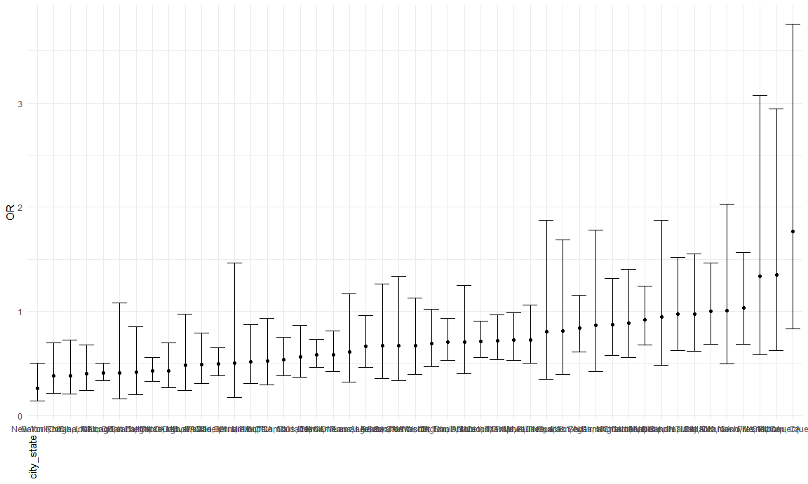

p8105\_hw6\_ww2579
================
Wenzhao Wu
11/24/2020

# Problem 1

``` r
homicide_df = 
  read_csv("data/homicide_data.csv", na = c("", "NA", "Unknown")) %>% 
  mutate(
    city_state = str_c(city, state, sep = ", "),
    victim_age = as.numeric(victim_age),
    resolution = case_when(
      disposition == "Closed without arrest" ~ 0,
      disposition == "Open/No arrest"        ~ 0,
      disposition == "Closed by arrest"      ~ 1)
  ) %>% 
  filter(
    victim_race %in% c("White", "Black"),
    city_state != "Tulsa, AL") %>% 
  select(city_state, resolution, victim_age, victim_race, victim_sex)
```

    ## Parsed with column specification:
    ## cols(
    ##   uid = col_character(),
    ##   reported_date = col_double(),
    ##   victim_last = col_character(),
    ##   victim_first = col_character(),
    ##   victim_race = col_character(),
    ##   victim_age = col_double(),
    ##   victim_sex = col_character(),
    ##   city = col_character(),
    ##   state = col_character(),
    ##   lat = col_double(),
    ##   lon = col_double(),
    ##   disposition = col_character()
    ## )

Start with one city.

``` r
baltimore_df = 
  homicide_df %>%
  filter(city_state == "Baltimore, MD")

glm(resolution ~ victim_age + victim_sex + victim_race, data = baltimore_df,family = binomial()) %>%
  broom::tidy() %>%
  mutate(
    OR = exp(estimate),
    CL_lower = exp(estimate - 1.96 * std.error),
    CL_upper = exp(estimate + 1.96 * std.error)) %>%
  select(term, OR, starts_with(("CI"))) %>%
  knitr::kable(digits = 3)
```

| term              |    OR |
| :---------------- | ----: |
| (Intercept)       | 1.363 |
| victim\_age       | 0.993 |
| victim\_sexMale   | 0.426 |
| victim\_raceWhite | 2.320 |

Try this across cities.

``` r
models_results_df = 
  homicide_df %>%
  nest(data = -city_state) %>%
  mutate(
    models = 
      map(.x = data, ~glm(resolution ~ victim_age + victim_race + victim_sex, data = .x, family = binomial())),
    results = map(models, broom::tidy)) %>%
  select(city_state, results) %>%
  unnest(results) %>%
  mutate(
    OR = exp(estimate),
    CI_lower = exp(estimate - 1.96 * std.error),
    CI_upper = exp(estimate + 1.96 * std.error)) %>%
  select(city_state, term, OR, starts_with(("CI")))
```

Make a plot of city\_state vs OR.

``` r
models_results_df %>%
  filter(term == "victim_sexMale") %>%
  mutate(city_state = fct_reorder(city_state, OR)) %>%
  ggplot(aes(x = city_state, y = OR)) +
  geom_point() +
  geom_errorbar(aes(ymin = CI_lower, ymax = CI_upper)) +
  theme(axis.title.x = element_text(angle = 90, hjust = 1))
```


