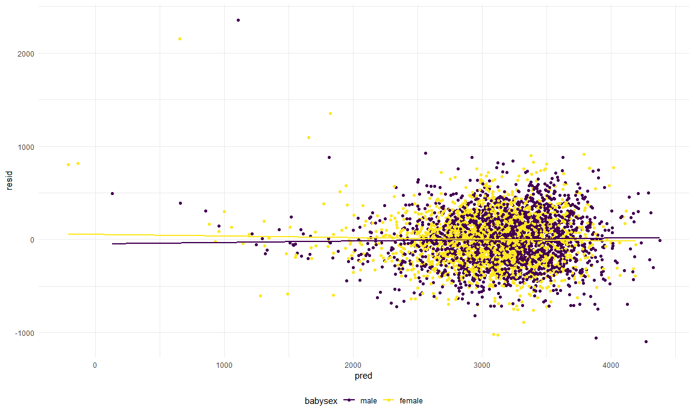
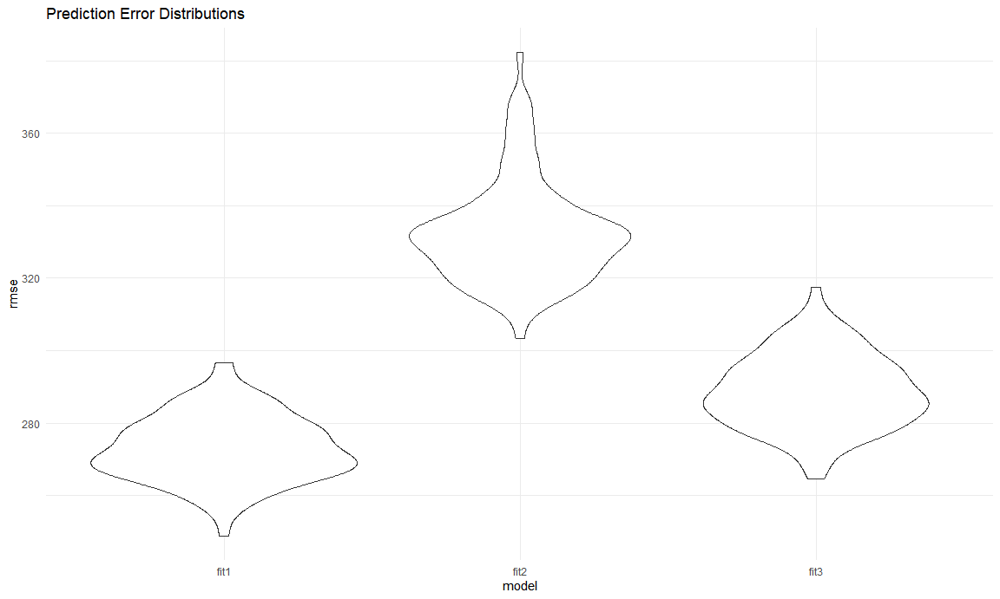

p8105\_hw6\_ww2579
================
Wenzhao Wu
11/24/2020

# Problem 1

``` r
homicide_df = 
  read_csv("data/homicide_data.csv", na = c("", "NA", "Unknown")) %>% 
  mutate(
    city_state = str_c(city, state, sep = ", "),
    victim_age = as.numeric(victim_age),
    resolution = case_when(
      disposition == "Closed without arrest" ~ 0,
      disposition == "Open/No arrest"        ~ 0,
      disposition == "Closed by arrest"      ~ 1)
  ) %>% 
  filter(
    victim_race %in% c("White", "Black"),
    city_state != "Tulsa, AL") %>% 
  select(city_state, resolution, victim_age, victim_race, victim_sex)
```

    ## Parsed with column specification:
    ## cols(
    ##   uid = col_character(),
    ##   reported_date = col_double(),
    ##   victim_last = col_character(),
    ##   victim_first = col_character(),
    ##   victim_race = col_character(),
    ##   victim_age = col_double(),
    ##   victim_sex = col_character(),
    ##   city = col_character(),
    ##   state = col_character(),
    ##   lat = col_double(),
    ##   lon = col_double(),
    ##   disposition = col_character()
    ## )

Start with one city.

``` r
baltimore_df = 
  homicide_df %>%
  filter(city_state == "Baltimore, MD")

glm(resolution ~ victim_age + victim_sex + victim_race, data = baltimore_df,family = binomial()) %>%
  broom::tidy() %>%
  mutate(
    OR = exp(estimate),
    CL_lower = exp(estimate - 1.96 * std.error),
    CL_upper = exp(estimate + 1.96 * std.error)) %>%
  select(term, OR, starts_with(("CI"))) %>%
  knitr::kable(digits = 3)
```

| term              |    OR |
| :---------------- | ----: |
| (Intercept)       | 1.363 |
| victim\_age       | 0.993 |
| victim\_sexMale   | 0.426 |
| victim\_raceWhite | 2.320 |

Try this across cities.

``` r
models_results_df = 
  homicide_df %>%
  nest(data = -city_state) %>%
  mutate(
    models = 
      map(.x = data, ~glm(resolution ~ victim_age + victim_race + victim_sex, data = .x, family = binomial())),
    results = map(models, broom::tidy)) %>%
  select(city_state, results) %>%
  unnest(results) %>%
  mutate(
    OR = exp(estimate),
    CI_lower = exp(estimate - 1.96 * std.error),
    CI_upper = exp(estimate + 1.96 * std.error)) %>%
  select(city_state, term, OR, starts_with(("CI")))
```

Make a plot of city\_state vs OR.

``` r
models_results_df %>%
  filter(term == "victim_sexMale") %>%
  mutate(city_state = fct_reorder(city_state, OR)) %>%
  ggplot(aes(x = city_state, y = OR)) +
  geom_point() +
  geom_errorbar(aes(ymin = CI_lower, ymax = CI_upper)) +
  theme(axis.title.x = element_text(angle = 90, hjust = 1))
```


# Problem 2

Import and tidy the raw data.

``` r
bwt_df = read.csv("./data/birthweight.csv") %>%
  mutate(babysex = as.factor(babysex),
         frace = as.factor(frace),
         malform = as.factor(malform),
         mrace = as.factor(mrace),
         parity = as.factor(parity)) %>%
  filter(parity != 3,
         parity != 6)
# Parity levels of 3 and 6 get removed because they contain only one observation, when I do the cross-validation step, errors would occur if the two single observations are included in the model.
```

Fit a regression model for birthweight.

``` r
fit_bwt = lm(bwt~babysex + bhead + blength + delwt + fincome + frace + gaweeks + malform + menarche + mheight + momage + mrace + parity + pnumlbw + pnumsga + ppbmi + ppwt + smoken + wtgain, data = bwt_df)

step(fit_bwt, direction = "backward")
```

    ## Start:  AIC=48696.73
    ## bwt ~ babysex + bhead + blength + delwt + fincome + frace + gaweeks + 
    ##     malform + menarche + mheight + momage + mrace + parity + 
    ##     pnumlbw + pnumsga + ppbmi + ppwt + smoken + wtgain
    ## 
    ## 
    ## Step:  AIC=48696.73
    ## bwt ~ babysex + bhead + blength + delwt + fincome + frace + gaweeks + 
    ##     malform + menarche + mheight + momage + mrace + parity + 
    ##     pnumlbw + pnumsga + ppbmi + ppwt + smoken
    ## 
    ## 
    ## Step:  AIC=48696.73
    ## bwt ~ babysex + bhead + blength + delwt + fincome + frace + gaweeks + 
    ##     malform + menarche + mheight + momage + mrace + parity + 
    ##     pnumlbw + ppbmi + ppwt + smoken
    ## 
    ## 
    ## Step:  AIC=48696.73
    ## bwt ~ babysex + bhead + blength + delwt + fincome + frace + gaweeks + 
    ##     malform + menarche + mheight + momage + mrace + parity + 
    ##     ppbmi + ppwt + smoken
    ## 
    ##            Df Sum of Sq       RSS   AIC
    ## - frace     4    124327 320798404 48690
    ## - malform   1      1419 320675497 48695
    ## - ppbmi     1      6404 320680482 48695
    ## - momage    1     29190 320703267 48695
    ## - mheight   1     66897 320740975 48696
    ## - parity    1     91516 320765594 48696
    ## - menarche  1    114790 320788868 48696
    ## - ppwt      1    131451 320805529 48697
    ## <none>                  320674078 48697
    ## - fincome   1    195737 320869815 48697
    ## - mrace     3    868995 321543073 48702
    ## - babysex   1    850077 321524155 48706
    ## - gaweeks   1   4591143 325265221 48756
    ## - smoken    1   5084657 325758735 48763
    ## - delwt     1   8017759 328691837 48802
    ## - blength   1 102100505 422774583 49894
    ## - bhead     1 106411593 427085671 49938
    ## 
    ## Step:  AIC=48690.41
    ## bwt ~ babysex + bhead + blength + delwt + fincome + gaweeks + 
    ##     malform + menarche + mheight + momage + mrace + parity + 
    ##     ppbmi + ppwt + smoken
    ## 
    ##            Df Sum of Sq       RSS   AIC
    ## - malform   1      1447 320799852 48688
    ## - ppbmi     1      7035 320805440 48689
    ## - momage    1     28905 320827309 48689
    ## - mheight   1     69512 320867917 48689
    ## - parity    1     91675 320890079 48690
    ## - menarche  1    118883 320917287 48690
    ## - ppwt      1    134283 320932687 48690
    ## <none>                  320798404 48690
    ## - fincome   1    196711 320995115 48691
    ## - babysex   1    848422 321646827 48700
    ## - gaweeks   1   4604454 325402858 48750
    ## - smoken    1   5044590 325842995 48756
    ## - delwt     1   8021925 328820330 48796
    ## - mrace     3  13561750 334360154 48864
    ## - blength   1 102045932 422844337 49887
    ## - bhead     1 106539197 427337601 49933
    ## 
    ## Step:  AIC=48688.43
    ## bwt ~ babysex + bhead + blength + delwt + fincome + gaweeks + 
    ##     menarche + mheight + momage + mrace + parity + ppbmi + ppwt + 
    ##     smoken
    ## 
    ##            Df Sum of Sq       RSS   AIC
    ## - ppbmi     1      6988 320806840 48687
    ## - momage    1     29189 320829041 48687
    ## - mheight   1     69330 320869182 48687
    ## - parity    1     91653 320891505 48688
    ## - menarche  1    119206 320919058 48688
    ## - ppwt      1    134215 320934067 48688
    ## <none>                  320799852 48688
    ## - fincome   1    196086 320995938 48689
    ## - babysex   1    847570 321647422 48698
    ## - gaweeks   1   4603253 325403105 48748
    ## - smoken    1   5043396 325843248 48754
    ## - delwt     1   8037921 328837773 48794
    ## - mrace     3  13574667 334374519 48862
    ## - blength   1 102059467 422859319 49885
    ## - bhead     1 106551539 427351391 49931
    ## 
    ## Step:  AIC=48686.53
    ## bwt ~ babysex + bhead + blength + delwt + fincome + gaweeks + 
    ##     menarche + mheight + momage + mrace + parity + ppwt + smoken
    ## 
    ##            Df Sum of Sq       RSS   AIC
    ## - momage    1     29731 320836571 48685
    ## - parity    1     91730 320898570 48686
    ## - menarche  1    120843 320927683 48686
    ## <none>                  320806840 48687
    ## - fincome   1    197536 321004376 48687
    ## - babysex   1    846289 321653129 48696
    ## - mheight   1   1074748 321881588 48699
    ## - ppwt      1   2936089 323742929 48724
    ## - gaweeks   1   4600576 325407416 48746
    ## - smoken    1   5047513 325854353 48752
    ## - delwt     1   8033739 328840579 48792
    ## - mrace     3  13572731 334379571 48860
    ## - blength   1 102068715 422875555 49883
    ## - bhead     1 106698523 427505363 49931
    ## 
    ## Step:  AIC=48684.93
    ## bwt ~ babysex + bhead + blength + delwt + fincome + gaweeks + 
    ##     menarche + mheight + mrace + parity + ppwt + smoken
    ## 
    ##            Df Sum of Sq       RSS   AIC
    ## - parity    1     93512 320930083 48684
    ## - menarche  1    102957 320939527 48684
    ## <none>                  320836571 48685
    ## - fincome   1    243892 321080463 48686
    ## - babysex   1    837411 321673982 48694
    ## - mheight   1   1072930 321909500 48697
    ## - ppwt      1   2914802 323751372 48722
    ## - gaweeks   1   4653816 325490387 48745
    ## - smoken    1   5052936 325889507 48751
    ## - delwt     1   8008803 328845373 48790
    ## - mrace     3  14689757 335526327 48873
    ## - blength   1 102040170 422876740 49881
    ## - bhead     1 106743610 427580181 49929
    ## 
    ## Step:  AIC=48684.19
    ## bwt ~ babysex + bhead + blength + delwt + fincome + gaweeks + 
    ##     menarche + mheight + mrace + ppwt + smoken
    ## 
    ##            Df Sum of Sq       RSS   AIC
    ## - menarche  1     98220 321028303 48684
    ## <none>                  320930083 48684
    ## - fincome   1    238127 321168210 48685
    ## - babysex   1    846201 321776283 48694
    ## - mheight   1   1074735 322004818 48697
    ## - ppwt      1   2911083 323841166 48721
    ## - gaweeks   1   4674669 325604752 48745
    ## - smoken    1   5047227 325977309 48750
    ## - delwt     1   8004211 328934294 48789
    ## - mrace     3  14668897 335598980 48872
    ## - blength   1 101952156 422882238 49879
    ## - bhead     1 106889496 427819579 49930
    ## 
    ## Step:  AIC=48683.52
    ## bwt ~ babysex + bhead + blength + delwt + fincome + gaweeks + 
    ##     mheight + mrace + ppwt + smoken
    ## 
    ##           Df Sum of Sq       RSS   AIC
    ## <none>                 321028303 48684
    ## - fincome  1    242928 321271231 48685
    ## - babysex  1    850950 321879253 48693
    ## - mheight  1   1011050 322039353 48695
    ## - ppwt     1   2904472 323932775 48721
    ## - gaweeks  1   4661170 325689473 48744
    ## - smoken   1   5075737 326104040 48750
    ## - delwt    1   8139822 329168125 48790
    ## - mrace    3  14684651 335712953 48872
    ## - blength  1 102153225 423181528 49881
    ## - bhead    1 106805786 427834089 49928

    ## 
    ## Call:
    ## lm(formula = bwt ~ babysex + bhead + blength + delwt + fincome + 
    ##     gaweeks + mheight + mrace + ppwt + smoken, data = bwt_df)
    ## 
    ## Coefficients:
    ## (Intercept)     babysex2        bhead      blength        delwt      fincome  
    ##  -6098.9607      28.6380     130.7953      74.9322       4.1074       0.3163  
    ##     gaweeks      mheight       mrace2       mrace3       mrace4         ppwt  
    ##     11.6018       6.5906    -138.8199     -74.9133    -100.7536      -2.6747  
    ##      smoken  
    ##     -4.8447

``` r
multi10_fit = lm(bwt~babysex + bhead + blength + delwt + fincome + gaweeks + mheight + mrace + ppwt + smoken, data = bwt_df)

multi3_fit = lm(bwt~babysex + bhead + blength, data = bwt_df)
# Criterion-based procedures
AIC(fit_bwt)
```

    ## [1] 61015.12

``` r
AIC(multi3_fit)
```

    ## [1] 61490.97

``` r
AIC(multi10_fit)
```

    ## [1] 61001.91

First, I fitted all variables in a MLR model, and apply stepwise
regression to select predictors for the “best” model. Then I used the
criterion-based procedures to check for AIC. Compared to the values of
AIC from the full model (19 predictors) and 3-predictor model, the model
obtained from the stepwise elimination has the smallest AIC.

Selected predictors: babysex, bhead, blength, delwt, fincome, gaweeks,
mheight, mrace, ppwt, smoken.

Plot model residuals vs fitted values.

``` r
new_df = bwt_df %>%
  add_predictions(multi10_fit) %>%
  add_residuals(multi10_fit)

resid_pred_plt = 
  new_df %>%
  ggplot(aes(x = pred, y = resid)) +
  geom_point() +
  geom_smooth(method = "lm", se = F)

resid_pred_plt
```

    ## `geom_smooth()` using formula 'y ~ x'



The second fitted model:

``` r
fit2 = lm(bwt~blength + gaweeks, data = bwt_df)
```

The third fitted model:

``` r
fit3 = lm(bwt~babysex + bhead + blength + babysex*bhead + babysex*blength + babysex*bhead*blength, data = bwt_df)
```

Compare 3 models above using cross validation.

``` r
cv_df = crossv_mc(bwt_df,100)
cv_df =
  cv_df %>% 
  mutate(
    train = map(train, as_tibble),
    test = map(test, as_tibble))

    
cv_df = 
  cv_df %>% 
  mutate(  
    fit1 = map(train, ~lm(data = .x, bwt~babysex + bhead + blength + delwt + fincome + gaweeks + mheight + mrace + ppwt + smoken)), 
    fit2 = map(train, ~lm(bwt~blength + gaweeks, data = .x)),
    fit3 = map(train, ~lm(bwt~babysex + bhead + blength + babysex*bhead + babysex*blength + babysex*bhead*blength, data = .x))) %>% 
  mutate(rmse_fit1 = map2(fit1, test, ~rmse(model = .x, data = .y)), 
         rmse_fit2 = map2(fit2, test, ~rmse(model = .x, data = .y)),
         rmse_fit3 = map2(fit3, test, ~rmse(model = .x, data = .y)))

cv_df %>% 
  select(starts_with("rmse")) %>% 
  pivot_longer(
    everything(),
    names_to = "model", 
    values_to = "rmse",
    names_prefix = "rmse_") %>%
  unnest(rmse) %>%
  mutate(model = fct_inorder(model)) %>% 
  ggplot(aes(x = model, y = rmse)) + 
  geom_violin() +
  labs(
    title = "Prediction Error Distributions"
  )
```



**Comments:**
