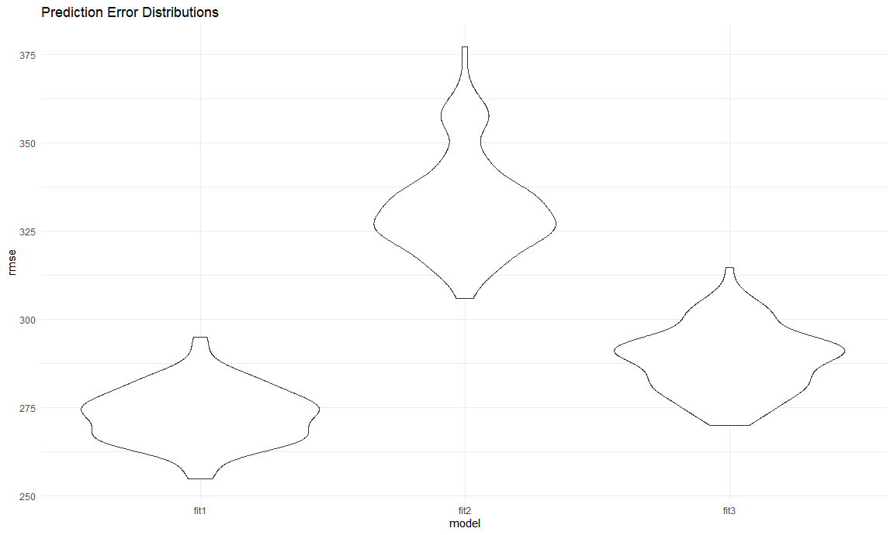

p8105\_hw6\_ww2579
================
Wenzhao Wu
11/24/2020

# Problem 1

``` r
homicide_df = 
  read_csv("data/homicide_data.csv", na = c("", "NA", "Unknown")) %>% 
  mutate(
    city_state = str_c(city, state, sep = ", "),
    victim_age = as.numeric(victim_age),
    resolution = case_when(
      disposition == "Closed without arrest" ~ 0,
      disposition == "Open/No arrest"        ~ 0,
      disposition == "Closed by arrest"      ~ 1)
  ) %>% 
  filter(
    victim_race %in% c("White", "Black"),
    city_state != "Tulsa, AL") %>% 
  select(city_state, resolution, victim_age, victim_race, victim_sex)
```

    ## Parsed with column specification:
    ## cols(
    ##   uid = col_character(),
    ##   reported_date = col_double(),
    ##   victim_last = col_character(),
    ##   victim_first = col_character(),
    ##   victim_race = col_character(),
    ##   victim_age = col_double(),
    ##   victim_sex = col_character(),
    ##   city = col_character(),
    ##   state = col_character(),
    ##   lat = col_double(),
    ##   lon = col_double(),
    ##   disposition = col_character()
    ## )

Start with one city.

``` r
baltimore_df = 
  homicide_df %>%
  filter(city_state == "Baltimore, MD")

glm(resolution ~ victim_age + victim_sex + victim_race, data = baltimore_df,family = binomial()) %>%
  broom::tidy() %>%
  mutate(
    OR = exp(estimate),
    CI_lower = exp(estimate - 1.96 * std.error),
    CI_upper = exp(estimate + 1.96 * std.error)) %>%
  select(term, OR, starts_with(("CI"))) %>%
  knitr::kable(digits = 3)
```

| term              |    OR | CI\_lower | CI\_upper |
| :---------------- | ----: | --------: | --------: |
| (Intercept)       | 1.363 |     0.975 |     1.907 |
| victim\_age       | 0.993 |     0.987 |     1.000 |
| victim\_sexMale   | 0.426 |     0.325 |     0.558 |
| victim\_raceWhite | 2.320 |     1.648 |     3.268 |

Try this across cities.

``` r
models_results_df = 
  homicide_df %>%
  nest(data = -city_state) %>%
  mutate(
    models = 
      map(.x = data, ~glm(resolution ~ victim_age + victim_race + victim_sex, data = .x, family = binomial())),
    results = map(models, broom::tidy)) %>%
  select(city_state, results) %>%
  unnest(results) %>%
  mutate(
    OR = exp(estimate),
    CI_lower = exp(estimate - 1.96 * std.error),
    CI_upper = exp(estimate + 1.96 * std.error)) %>%
  select(city_state, term, OR, starts_with(("CI")))
```

Make a plot of city\_state vs OR.

``` r
models_results_df %>%
  filter(term == "victim_sexMale") %>%
  mutate(city_state = fct_reorder(city_state, OR)) %>%
  ggplot(aes(x = city_state, y = OR)) +
  geom_point() +
  geom_errorbar(aes(ymin = CI_lower, ymax = CI_upper)) +
  theme(axis.title.x = element_text(angle = 90, hjust = 1))
```


# Problem 2

Import and tidy the raw data.

``` r
bwt_df = read.csv("./data/birthweight.csv") %>%
  mutate(babysex = as.factor(babysex),
         frace = as.factor(frace),
         malform = as.factor(malform),
         mrace = as.factor(mrace),
         parity = as.factor(parity)) %>%
  mutate(babysex = recode(babysex, "1" = "male", "2" = "female"),
         mrace = recode(mrace, "1" = "White", "2" = "Black", "3" = "Asian", "4" = "Puerto Rican", "8" = "Other"))
```

Fit a regression model for birthweight.

``` r
# Full model
fit_bwt = lm(bwt~babysex + bhead + blength + delwt + fincome + frace + gaweeks + malform + menarche + mheight + momage + mrace + parity + pnumlbw + pnumsga + ppbmi + ppwt + smoken + wtgain, data = bwt_df)

# 10 predictors model
multi10_fit = lm(bwt~babysex + bhead + blength + delwt + fincome + gaweeks + mheight + mrace + ppwt + smoken, data = bwt_df)

# 6-predictor model
multi6_fit = lm(bwt~babysex + bhead + blength + delwt + gaweeks + mrace, data = bwt_df)

# 4-predictor model
multi4_fit = lm(bwt~babysex + bhead + blength + wtgain, data = bwt_df)

# Look at adjusted r^2 and AIC
broom::glance(fit_bwt)
```

    ## # A tibble: 1 x 12
    ##   r.squared adj.r.squared sigma statistic p.value    df  logLik    AIC    BIC
    ##       <dbl>         <dbl> <dbl>     <dbl>   <dbl> <dbl>   <dbl>  <dbl>  <dbl>
    ## 1     0.718         0.717  273.      479.       0    23 -30498. 61045. 61205.
    ## # ... with 3 more variables: deviance <dbl>, df.residual <int>, nobs <int>

``` r
broom::glance(multi10_fit)
```

    ## # A tibble: 1 x 12
    ##   r.squared adj.r.squared sigma statistic p.value    df  logLik    AIC    BIC
    ##       <dbl>         <dbl> <dbl>     <dbl>   <dbl> <dbl>   <dbl>  <dbl>  <dbl>
    ## 1     0.718         0.717  272.      917.       0    12 -30503. 61033. 61122.
    ## # ... with 3 more variables: deviance <dbl>, df.residual <int>, nobs <int>

``` r
broom::glance(multi6_fit)
```

    ## # A tibble: 1 x 12
    ##   r.squared adj.r.squared sigma statistic p.value    df  logLik    AIC    BIC
    ##       <dbl>         <dbl> <dbl>     <dbl>   <dbl> <dbl>   <dbl>  <dbl>  <dbl>
    ## 1     0.710         0.710  276.     1327.       0     8 -30560. 61140. 61204.
    ## # ... with 3 more variables: deviance <dbl>, df.residual <int>, nobs <int>

``` r
broom::glance(multi4_fit)
```

    ## # A tibble: 1 x 12
    ##   r.squared adj.r.squared sigma statistic p.value    df  logLik    AIC    BIC
    ##       <dbl>         <dbl> <dbl>     <dbl>   <dbl> <dbl>   <dbl>  <dbl>  <dbl>
    ## 1     0.689         0.689  286.     2402.       0     4 -30713. 61438. 61477.
    ## # ... with 3 more variables: deviance <dbl>, df.residual <int>, nobs <int>

First, I fitted all variables in a MLR model, and select variables of
interest to build different models. Based on the summary of regression
models, I compare the adjusted r^2 to check the goodness of fit. Among
the 4 models above, the model with 10 predictors has the largest value
of the adjusted r^2. Then I applied the criterion-based procedures to
check for AIC to obtain a relatively “good” model. As a result, the
10-predictor model has the smallest AIC value.

Selected predictors: babysex, bhead, blength, delwt, fincome, gaweeks,
mheight, mrace, ppwt, smoken.

Plot model residuals vs fitted values.

``` r
new_df = bwt_df %>%
  add_predictions(multi10_fit) %>%
  add_residuals(multi10_fit)

resid_pred_plt = 
  new_df %>%
  ggplot(aes(x = pred, y = resid,color = babysex)) +
  geom_point() +
  geom_smooth(method = "lm", se = F)

resid_pred_plt
```

    ## `geom_smooth()` using formula 'y ~ x'


**Interpretation:**

As it is shown on the graph, most of the residuals bounce around 0, but
the variance seems not quite constant and outliers are observed on the
upper left.

The second fitted model:

``` r
fit2 = lm(bwt~blength + gaweeks, data = bwt_df)
summary(fit2)
```

    ## 
    ## Call:
    ## lm(formula = bwt ~ blength + gaweeks, data = bwt_df)
    ## 
    ## Residuals:
    ##     Min      1Q  Median      3Q     Max 
    ## -1709.6  -215.4   -11.4   208.2  4188.8 
    ## 
    ## Coefficients:
    ##              Estimate Std. Error t value Pr(>|t|)    
    ## (Intercept) -4347.667     97.958  -44.38   <2e-16 ***
    ## blength       128.556      1.990   64.60   <2e-16 ***
    ## gaweeks        27.047      1.718   15.74   <2e-16 ***
    ## ---
    ## Signif. codes:  0 '***' 0.001 '**' 0.01 '*' 0.05 '.' 0.1 ' ' 1
    ## 
    ## Residual standard error: 333.2 on 4339 degrees of freedom
    ## Multiple R-squared:  0.5769, Adjusted R-squared:  0.5767 
    ## F-statistic:  2958 on 2 and 4339 DF,  p-value: < 2.2e-16

The third fitted model:

``` r
fit3 = lm(bwt~babysex*bhead*blength, data = bwt_df)
summary(fit3)
```

    ## 
    ## Call:
    ## lm(formula = bwt ~ babysex * bhead * blength, data = bwt_df)
    ## 
    ## Residuals:
    ##      Min       1Q   Median       3Q      Max 
    ## -1132.99  -190.42   -10.33   178.63  2617.96 
    ## 
    ## Coefficients:
    ##                               Estimate Std. Error t value Pr(>|t|)    
    ## (Intercept)                 -7176.8170  1264.8397  -5.674 1.49e-08 ***
    ## babysexfemale                6374.8684  1677.7669   3.800 0.000147 ***
    ## bhead                         181.7956    38.0542   4.777 1.84e-06 ***
    ## blength                       102.1269    26.2118   3.896 9.92e-05 ***
    ## babysexfemale:bhead          -198.3932    51.0917  -3.883 0.000105 ***
    ## babysexfemale:blength        -123.7729    35.1185  -3.524 0.000429 ***
    ## bhead:blength                  -0.5536     0.7802  -0.710 0.478012    
    ## babysexfemale:bhead:blength     3.8781     1.0566   3.670 0.000245 ***
    ## ---
    ## Signif. codes:  0 '***' 0.001 '**' 0.01 '*' 0.05 '.' 0.1 ' ' 1
    ## 
    ## Residual standard error: 287.7 on 4334 degrees of freedom
    ## Multiple R-squared:  0.6849, Adjusted R-squared:  0.6844 
    ## F-statistic:  1346 on 7 and 4334 DF,  p-value: < 2.2e-16

**Comments:**

Based on regression analysis of two models, the model with a 3-way
interaction seems fit better than the two-predictor model. The larger
r^2 value implies a better “goodness of fit”. From the results of fit3,
the 3-way interaction of sex, head circumference and length at birth is
statistically significant; while there seems no interaction effect
between the head circumference and baby’s length at birth.

Compare 3 models above using cross validation.

``` r
cv_df = crossv_mc(bwt_df,100)
cv_df =
  cv_df %>% 
  mutate(
    train = map(train, as_tibble),
    test = map(test, as_tibble))

    
cv_df = 
  cv_df %>% 
  mutate(  
    fit1 = map(train, ~lm(data = .x, bwt~babysex + bhead + blength + delwt + fincome + gaweeks + mheight + mrace + ppwt + smoken)), 
    fit2 = map(train, ~lm(bwt~blength + gaweeks, data = .x)),
    fit3 = map(train, ~lm(bwt~babysex*bhead*blength, data = .x))) %>% 
  mutate(rmse_fit1 = map2(fit1, test, ~rmse(model = .x, data = .y)), 
         rmse_fit2 = map2(fit2, test, ~rmse(model = .x, data = .y)),
         rmse_fit3 = map2(fit3, test, ~rmse(model = .x, data = .y)))

cv_df %>% 
  select(starts_with("rmse")) %>% 
  pivot_longer(
    everything(),
    names_to = "model", 
    values_to = "rmse",
    names_prefix = "rmse_") %>%
  unnest(rmse) %>%
  mutate(model = fct_inorder(model)) %>% 
  ggplot(aes(x = model, y = rmse)) + 
  geom_violin() +
  labs(
    title = "Prediction Error Distributions")
```



**Comments:**

Fit1 is the model that I built by variable selection. Fit2 uses length
at birth and gestational age as predictors. Fit3 is the one contains
3-way interaction term. The graph of “Prediction Error Distributions” is
used to compared predictive performance of different models. RMSE is
computed for measurements. Based on what is shown on the graph, the
first fitted model (i.e. 10-predictor model) has the lowest value of
RMSE, thus has the best predictive performance among the three models.
The second one, however, has the least predictive accuracy.

# Problem 3

Import and tidy and weather\_df.

``` r
weather_df = 
  rnoaa::meteo_pull_monitors(
    c("USW00094728"),
    var = c("PRCP", "TMIN", "TMAX"), 
    date_min = "2017-01-01",
    date_max = "2017-12-31") %>%
  mutate(
    name = recode(id, USW00094728 = "CentralPark_NY"),
    tmin = tmin / 10,
    tmax = tmax / 10) %>%
  select(name, id, everything())
```

    ## Registered S3 method overwritten by 'hoardr':
    ##   method           from
    ##   print.cache_info httr

    ## using cached file: C:\Users\WUWENZHAO\AppData\Local\cache/R/noaa_ghcnd/USW00094728.dly

    ## date created (size, mb): 2020-09-12 17:07:45 (7.533)

    ## file min/max dates: 1869-01-01 / 2020-09-30

Bootstrapping

``` r
set.seed(1)
bootstrap_df = weather_df %>%
  modelr::bootstrap(n = 5000) %>%
  mutate(models = map(strap, ~lm(tmax~tmin, data = .x)),
         r_squared = map(models, broom::glance),
         estimates = map(models, broom::tidy)) %>%
  unnest(r_squared,estimates)
```

    ## Warning: unnest() has a new interface. See ?unnest for details.
    ## Try `df %>% unnest(c(r_squared, estimates))`, with `mutate()` if needed

``` r
log_df = bootstrap_df %>%
  select(term, estimate, r.squared) %>%
  pivot_wider(names_from = term,
              values_from = estimate,
              values_fn = list) %>%
  unnest(cols = c(`(Intercept)`, tmin)) %>%
  rename("beta0" = '(Intercept)', "beta1" = tmin) %>%
  mutate(log_estimates = log(beta0*beta1))
```

Plot distributions of estimates

``` r
plot_r_squared = 
  log_df %>%
  ggplot(aes(x = r.squared)) +
  geom_density() + 
  labs(title = "r^2 Distribution")
plot_r_squared
```


``` r
plot_beta = 
  log_df %>%
  ggplot(aes(x = log_estimates)) +
  geom_density() +
  labs(title = "log_estimates Distribution")
plot_beta
```


**Comments:**

The distribution of r^2 seems to have a mean of 0.91, which is a quite
high coefficient of determination, indicating on average, the model fits
well on data. It can also be observed that there is a longer tail on the
left side of the curve, which may be related to the frequency with which
large outliers are included in bootstrap samples.

The distribution of log product of beta0 and beta1 is approximately
normal, with a mean of 2.01.

Compute 95% CI for r^2

``` r
lower_r2 = mean(log_df$r.squared) - qnorm(0.975) * sd(log_df$r.squared)
upper_r2 = mean(log_df$r.squared) + qnorm(0.975) * sd(log_df$r.squared)
```

Compute 95% CI for log product of beta0 and beta1

``` r
lower_log = mean(log_df$log_estimates) - qnorm(0.975) * sd(log_df$log_estimates)
upper_log = mean(log_df$log_estimates) + qnorm(0.975) * sd(log_df$log_estimates)
```

**Interpretation:**

We are 95% confident that the r^2 will fall in somewhere between 0.895
and 0.928 for the regression analysis of tmax vs tmin.

We are 95% confident that the log product of beta0 and beta1 will fall
in somewhere between 1.966 and 2.060 for the regression analysis of tmax
vs tmin.
